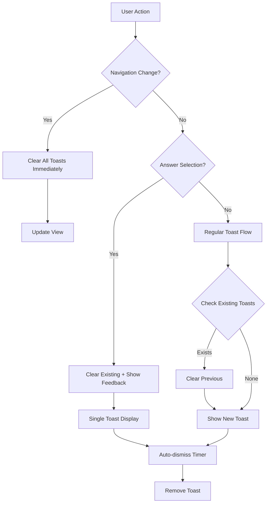

# Design Document

## Overview

Este documento describe el diseño técnico para resolver los problemas del sistema de toast cards, eliminando delays problemáticos, implementando limpieza inmediata al cambiar de pantalla, y asegurando que nunca aparezcan múltiples toast cards simultáneamente. El diseño también incluye un mensaje de bienvenida que se muestra solo la primera vez que el usuario accede al menú del juego.

## Architecture

### Current System Analysis

El sistema actual de toast cards presenta los siguientes problemas:
- **Delays innecesarios**: Todas las funciones de toast tienen un `setTimeout` con delay de 0ms que causa comportamientos impredecibles
- **Falta de limpieza**: No hay mecanismo automático para limpiar toasts al cambiar de vista
- **Múltiples toasts**: Pueden aparecer varios toasts simultáneamente causando apiñamiento visual
- **Tests obsoletos**: Los tests actuales no reflejan el comportamiento deseado

### New Architecture Design



## Components and Interfaces

### 1. Complete Legacy Code Removal

**Estrategia de eliminación:**
- Remover completamente el `toastStore.ts` actual y reescribir desde cero
- Eliminar todos los componentes `Toast.tsx` y `ToastContainer.tsx` existentes
- Borrar el hook `useToast.ts` actual y crear uno nuevo
- Remover todas las funciones de toast con delays del código actual
- Limpiar imports y referencias obsoletas en todos los componentes

**Archivos a eliminar/reescribir completamente:**
```
src/stores/toastStore.ts          → Reescribir desde cero
src/components/ui/Toast.tsx       → Reescribir desde cero  
src/components/ui/ToastContainer.tsx → Reescribir desde cero
src/hooks/useToast.ts            → Reescribir desde cero
```

### 2. Enhanced ToastStore (Nueva Implementación)

**Implementación completamente nueva:**
- Sistema de toast único sin delays
- Limpieza automática en navegación
- Garantizar un solo toast activo a la vez
- Persistencia para el mensaje de bienvenida
- Arquitectura simplificada sin código legacy

**Nueva interfaz:**
```typescript
interface EnhancedToastStore extends ToastStore {
  // Nuevos métodos
  clearOnNavigation: () => void;
  showWelcomeOnce: (moduleCount: number) => void;
  
  // Métodos modificados (sin delays)
  addToast: (toast: Omit<ToastData, 'id'>) => void;
  showSingleToast: (toast: Omit<ToastData, 'id'>) => void;
}
```

### 2. Navigation Hook Integration

**Nuevo hook: `useNavigationCleanup`**
```typescript
interface NavigationCleanupHook {
  clearToastsOnNavigation: () => void;
  registerNavigationListener: () => void;
}
```

### 3. Welcome Toast System

**LocalStorage integration:**
```typescript
interface WelcomeToastConfig {
  key: 'welcome-toast-shown';
  checkShown: () => boolean;
  markAsShown: () => void;
}
```

## Data Models

### 1. Enhanced ToastData

```typescript
interface ToastData {
  id: string;
  type: ToastType;
  title: string;
  message?: string;
  duration?: number;
  priority?: 'low' | 'normal' | 'high'; // Nueva propiedad
  action?: {
    label: string;
    onClick: () => void;
  };
}
```

### 2. Navigation State Tracking

```typescript
interface NavigationState {
  currentView: string;
  previousView: string;
  isNavigating: boolean;
}
```

### 3. Welcome Toast Persistence

```typescript
interface WelcomeToastState {
  hasShown: boolean;
  timestamp: number;
  moduleCount: number;
}
```

## Error Handling

### 1. Toast Display Failures

**Estrategia:**
- Fallback silencioso si el toast no puede mostrarse
- Logging de errores sin interrumpir la experiencia del usuario
- Retry automático para toasts críticos

### 2. LocalStorage Failures

**Manejo:**
```typescript
const safeLocalStorage = {
  getItem: (key: string) => {
    try {
      return localStorage.getItem(key);
    } catch {
      return null; // Fallback graceful
    }
  },
  setItem: (key: string, value: string) => {
    try {
      localStorage.setItem(key, value);
    } catch {
      // Fail silently, no toast persistence
    }
  }
};
```

### 3. Navigation Cleanup Failures

**Contingencia:**
- Si la limpieza automática falla, implementar limpieza manual en cada componente
- Timeout de seguridad para forzar limpieza después de 500ms

## Testing Strategy

### 1. Unit Tests Rewrite

**Nuevos tests para toastStore:**
```typescript
describe('Enhanced Toast Store', () => {
  test('should show toast immediately without delays');
  test('should clear all toasts on navigation');
  test('should prevent multiple simultaneous toasts');
  test('should show welcome toast only once');
  test('should persist welcome state in localStorage');
});
```

### 2. Integration Tests

**Flujos de navegación:**
```typescript
describe('Navigation Toast Cleanup', () => {
  test('should clear toasts when changing from quiz to menu');
  test('should clear toasts when changing between learning modes');
  test('should show welcome toast on first menu visit');
});
```

### 3. Component Tests

**Learning components:**
```typescript
describe('Learning Component Toast Integration', () => {
  test('should show immediate feedback on answer selection');
  test('should clear previous feedback before showing new');
  test('should not show multiple toasts simultaneously');
});
```

### 4. E2E Tests

**User workflows:**
```typescript
describe('Toast System E2E', () => {
  test('complete learning session with proper toast behavior');
  test('navigation between multiple modules');
  test('welcome toast appears only on first visit');
});
```

## CSS Architecture & Visual Design

### 1. BEM-Like Semantic Class Structure

**Nueva arquitectura CSS para toast cards:**
```css
/* Bloque principal */
.toast-card { }

/* Elementos */
.toast-card__container { }
.toast-card__icon { }
.toast-card__content { }
.toast-card__title { }
.toast-card__message { }
.toast-card__action { }
.toast-card__close { }

/* Modificadores de tipo */
.toast-card--success { }
.toast-card--error { }
.toast-card--warning { }
.toast-card--info { }

/* Modificadores de estado */
.toast-card--entering { }
.toast-card--visible { }
.toast-card--exiting { }

/* Modificadores de tamaño */
.toast-card--compact { }
.toast-card--minimal { }
```

### 2. Compact Interface Design Constraints

**Principios de diseño compacto:**
- Máximo 320px de ancho para toast cards en desktop
- Altura mínima necesaria (auto-sizing)
- Padding reducido: 12px en lugar de 16px
- Iconos de 16px en lugar de 20px
- Typography: 14px para título, 12px para mensaje
- Espaciado interno optimizado: 8px entre elementos
- Bordes redondeados sutiles: 6px border-radius

### 3. Mobile-First Responsive Design

**Breakpoints y adaptaciones móviles:**
```css
/* Mobile First - Base styles */
.toast-card {
  width: calc(100vw - 32px); /* 16px margin on each side */
  max-width: 320px;
  margin: 0 16px;
}

/* Tablet - 640px and up */
@media (min-width: 640px) {
  .toast-card {
    width: 320px;
    margin: 0;
  }
}

/* Desktop - 1024px and up */
@media (min-width: 1024px) {
  .toast-card {
    max-width: 380px; /* Slightly larger on desktop */
  }
}
```

**Mobile-specific constraints:**
- Mínimo 44px de altura para áreas tocables (iOS/Android guidelines)
- Posicionamiento adaptativo: top en móvil, top-right en desktop
- Touch-friendly close button: mínimo 44x44px área de toque
- Swipe-to-dismiss en móvil (opcional)
- Orientación landscape: posición ajustada para no bloquear contenido

**Layout responsive:**
```css
/* Base mobile styles */
.toast-card {
  width: calc(100vw - 32px);
  max-width: 320px;
  min-height: 44px; /* Minimum touch target */
  padding: 12px;
  border-radius: 6px;
  margin: 0 16px;
}

.toast-card__icon {
  width: 16px;
  height: 16px;
  margin-right: 8px;
  flex-shrink: 0;
}

.toast-card__title {
  font-size: 14px;
  font-weight: 600;
  line-height: 1.2;
}

.toast-card__message {
  font-size: 12px;
  line-height: 1.3;
  margin-top: 2px;
}

.toast-card__close {
  min-width: 44px;
  min-height: 44px;
  display: flex;
  align-items: center;
  justify-content: center;
}

/* Tablet and up */
@media (min-width: 640px) {
  .toast-card {
    width: 320px;
    margin: 0;
  }
}

/* Desktop */
@media (min-width: 1024px) {
  .toast-card {
    max-width: 380px;
  }
  
  .toast-card__title {
    font-size: 15px;
  }
  
  .toast-card__message {
    font-size: 13px;
  }
}
```

### 4. Mobile Positioning Strategy

**Posicionamiento adaptativo:**
```css
.toast-container {
  position: fixed;
  z-index: 99999;
  pointer-events: none;
}

/* Mobile - centered top */
@media (max-width: 639px) {
  .toast-container {
    top: 16px;
    left: 0;
    right: 0;
    display: flex;
    justify-content: center;
  }
}

/* Tablet and desktop - top right */
@media (min-width: 640px) {
  .toast-container {
    top: 16px;
    right: 16px;
    left: auto;
  }
}

/* Landscape mobile - adjusted position */
@media (max-width: 639px) and (orientation: landscape) {
  .toast-container {
    top: 8px;
  }
  
  .toast-card {
    padding: 8px 12px;
  }
}
```

## Implementation Details

### 1. Complete Rewrite Strategy

**Nueva implementación sin código legacy:**
```typescript
// Implementación completamente nueva - sin delays
export const createToastStore = () => {
  const state = {
    currentToast: null as ToastData | null,
    isVisible: false
  };

  return {
    showToast: (toast: Omit<ToastData, 'id'>) => {
      // Inmediato, sin setTimeout
      const newToast = { ...toast, id: generateId() };
      state.currentToast = newToast;
      state.isVisible = true;
      notifyListeners();
    },
    
    clearToast: () => {
      // Limpieza inmediata
      state.currentToast = null;
      state.isVisible = false;
      notifyListeners();
    }
  };
};
```

**Eliminación completa del código anterior:**
```typescript
// ELIMINAR COMPLETAMENTE - No mantener nada del código actual
// - Todas las funciones con setTimeout
// - Sistema de múltiples toasts
// - Lógica de animaciones complejas
// - Eventos personalizados para cerrar toasts
// - Sistema de tracking con Set<string>
```

**Implementar limpieza en navegación:**
```typescript
const clearOnNavigation = () => {
  // Limpieza inmediata sin animaciones
  setState({ toasts: [] });
  
  // Limpiar cualquier timer pendiente
  clearAllTimers();
};
```

### 2. Navigation Integration

**Hook de limpieza:**
```typescript
export const useNavigationCleanup = () => {
  const { clearOnNavigation } = useToastStore();
  
  useEffect(() => {
    const handleNavigation = () => {
      clearOnNavigation();
    };
    
    // Escuchar cambios de vista
    window.addEventListener('viewchange', handleNavigation);
    
    return () => {
      window.removeEventListener('viewchange', handleNavigation);
    };
  }, [clearOnNavigation]);
};
```

### 3. Welcome Toast Implementation

**En MainMenu component:**
```typescript
useEffect(() => {
  if (modules.length > 0 && !isLoading) {
    const hasShownWelcome = localStorage.getItem('welcome-toast-shown');
    
    if (!hasShownWelcome) {
      toast.single.success(
        'Bienvenido',
        `${modules.length} módulos disponibles para aprender`
      );
      localStorage.setItem('welcome-toast-shown', 'true');
    }
  }
}, [modules.length, isLoading]);
```

### 4. Single Toast Enforcement

**Modificar addToast:**
```typescript
addToast(toast: Omit<ToastData, 'id'>) {
  // Siempre limpiar toasts existentes primero
  this.setState({ toasts: [] });
  
  // Agregar el nuevo toast
  const newToast = { ...toast, id: generateId() };
  this.setState({ toasts: [newToast] });
  
  // Auto-remove después de duration
  if (newToast.duration && newToast.duration > 0) {
    setTimeout(() => {
      this.removeToast(newToast.id);
    }, newToast.duration);
  }
}
```

## Performance Considerations

### 1. Memory Management

- Limpiar listeners de eventos al desmontar componentes
- Evitar memory leaks en timers de auto-dismiss
- Optimizar re-renders del ToastContainer

### 2. Animation Performance

- Usar CSS transforms en lugar de cambios de layout
- Implementar animaciones con `will-change` para mejor performance
- Reducir duración de animaciones de salida para mejor responsividad

### 3. LocalStorage Optimization

- Minimizar escrituras a localStorage
- Usar debouncing para operaciones frecuentes
- Implementar cleanup de datos obsoletos

## Security Considerations

### 1. XSS Prevention

- Mantener sanitización de contenido HTML en toasts
- Validar datos de entrada antes de mostrar toasts
- Escapar caracteres especiales en mensajes dinámicos

### 2. LocalStorage Security

- No almacenar información sensible
- Validar datos leídos de localStorage
- Implementar fallbacks para datos corruptos

## Accessibility Improvements

### 1. Screen Reader Support

- Mantener `role="alert"` y `aria-live="polite"`
- Asegurar que los toasts sean anunciados correctamente
- Implementar `aria-describedby` para contexto adicional

### 2. Keyboard Navigation

- Permitir cerrar toasts con tecla Escape
- Mantener focus management durante transiciones
- Asegurar que los botones de acción sean accesibles por teclado

### 3. Visual Accessibility

- Mantener contraste adecuado en todos los temas
- Asegurar que las animaciones respeten `prefers-reduced-motion`
- Implementar indicadores visuales claros para diferentes tipos de toast